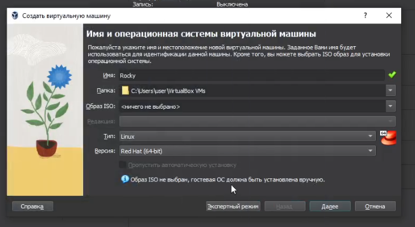
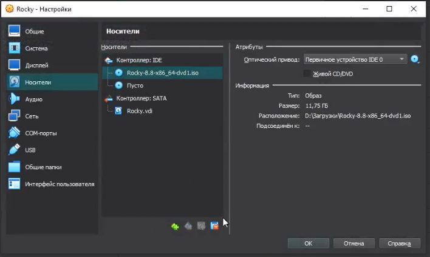
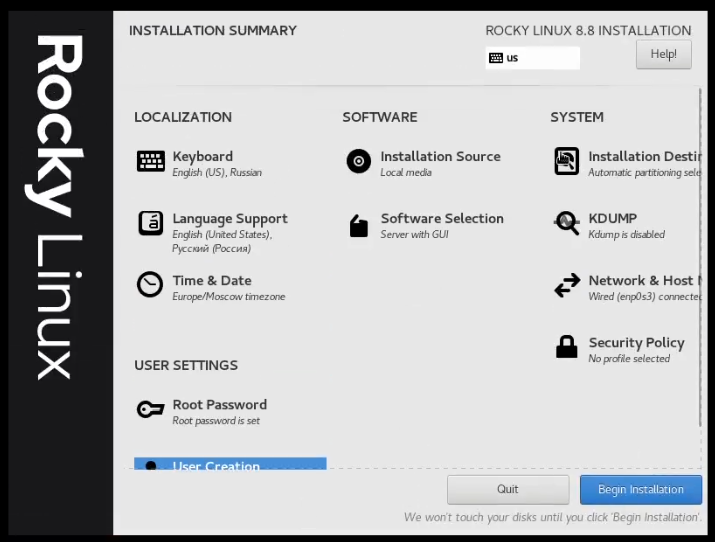
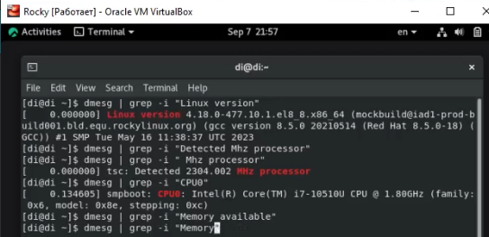
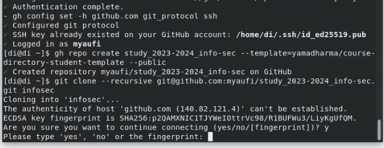
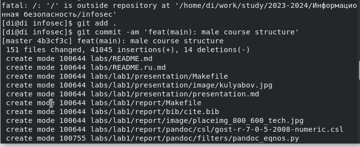

---
## Front matter
lang: ru-RU
title: Структура научной презентации
subtitle: Простейший шаблон
author:
  - Егорова Диана Витальевна
institute:
  - Российский университет дружбы народов, Москва, Россия
date: 08 сентября 2023

## i18n babel
babel-lang: russian
babel-otherlangs: english

## Formatting pdf
toc: false
toc-title: Содержание
slide_level: 2
aspectratio: 169
section-titles: true
theme: metropolis
header-includes:
 - \metroset{progressbar=frametitle,sectionpage=progressbar,numbering=fraction}
 - '\makeatletter'
 - '\beamer@ignorenonframefalse'
 - '\makeatother'
---

# Информация

## Докладчик

:::::::::::::: {.columns align=center}
::: {.column width="70%"}
  * Егорова Диана Витальевна
  * студент кафедры математического модулирования и искусственного интеллекта
  * Российский университет дружбы народов
  * [1032201662@rudn.ru](mailto:1032201662@rudn.ru)
:::
::: {.column width="30%"}

:::
::::::::::::::
# Вводная часть

## Актуальность

- Важно структурировать пространство под работы в любой сфере деятельности

## Объект и предмет исследования

- Презентация как текст
- Программное обеспечение для создания презентаций
- Входные и выходные форматы презентаций

## Цели и задачи

- Создать пространство для лабораторных работ
- Создать шаблон презентации в Markdown

## Материалы и методы

- Процессор `pandoc` для входного формата Markdown
- Операционная система `Rocky 8.6`
- Сервис для хостинга IT-проектов `GitHub`

# Результаты выполнения работы

## Создание новой виртуальной машины (рис. @fig:001).

{#fig:001 width=70%}

## Добавление носителя образ Rocky (рис. @fig:002).

{#fig:002 width=70%}

## Настройка основных параметров: язык, дата и время, администратор, хост сети (рис. @fig:003).

{#fig:003 width=70%}

## Окончание загрузки(рис. @fig:004).

{#fig:004 width=70%}

## Проверка заданных характеристик(рис. @fig:005).

{#fig:005 width=70%}

## Настройка соединения по ssh(рис. @fig:006).

{#fig:006 width=70%}

## Клонирование репозитория(рис. @fig:008) (рис. @fig:009).

{#fig:008 width=70%} (image/9.png) {#fig:009 width=70%}

# Вывод

- Структурирование пространство завершено успешно

