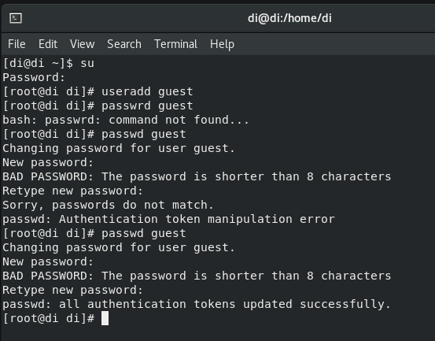
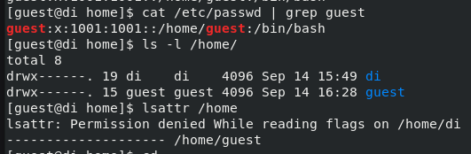
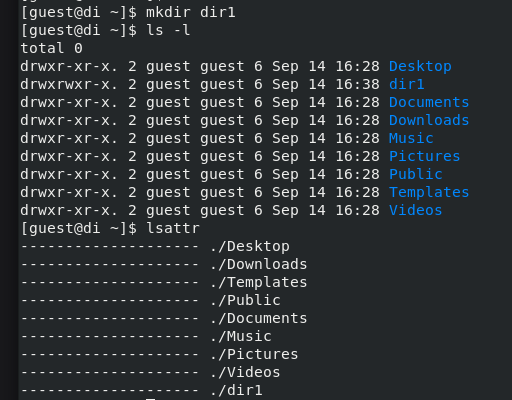
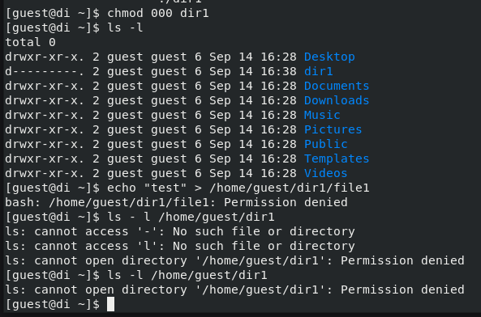
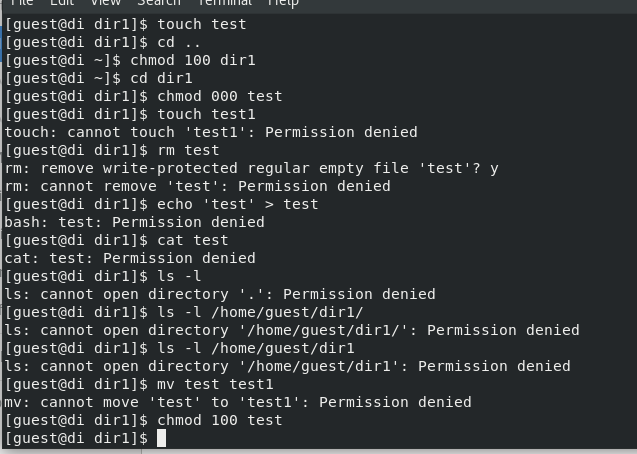
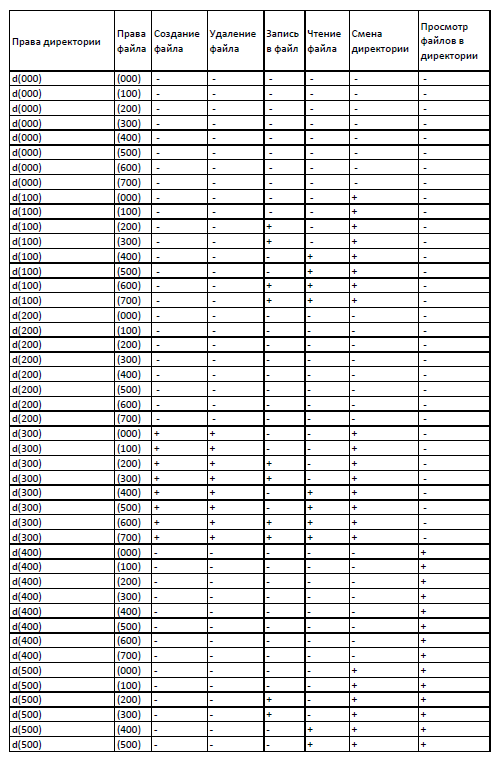
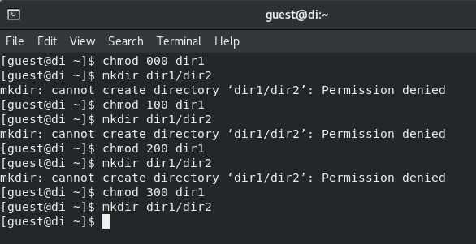
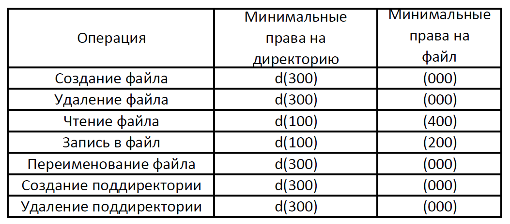

---
## Front matter
lang: ru-RU
title: Лабораторная работа №2
subtitle: "Дискреционное разграничение прав в Linux. Основные атрибуты"
author:
  - Егорова Диана Витальевна
institute:
  - Российский университет дружбы народов, Москва, Россия
date: 16 сентября 2023

## i18n babel
babel-lang: russian
babel-otherlangs: english

## Formatting pdf
toc: false
toc-title: Содержание
slide_level: 2
aspectratio: 169
section-titles: true
theme: metropolis
header-includes:
 - \metroset{progressbar=frametitle,sectionpage=progressbar,numbering=fraction}
 - '\makeatletter'
 - '\beamer@ignorenonframefalse'
 - '\makeatother'
---

# Информация

## Докладчик

:::::::::::::: {.columns align=center}
::: {.column width="70%"}
  * Егорова Диана Витальевна
  * студент кафедры математического модулирования и искусственного интеллекта
  * Российский университет дружбы народов
  * [1032201662@rudn.ru](mailto:1032201662@rudn.ru)
:::
::: {.column width="30%"}

:::
::::::::::::::
# Вводная часть

## Актуальность

- Важно структурировать пространство под работы в любой сфере деятельности

## Цели и задачи

- Получить практические навыки работы в консоли с атрибутами файлов
- Закрепить теоретические основы дискреционного разграничения доступа в современных системах с открытым кодом на базе ОС Linux
- Заполнить таблицу «Установленные права и разрешённые действия»
- На основе анализа предыдущей таблицы заполнить следующую "Минимальные права для совершения операций"

## Материалы и методы

- Процессор `pandoc` для входного формата Markdown
- Операционная система `Rocky 8.6`
- Сервис для хостинга IT-проектов `GitHub`

# Результаты выполнения работы

## В установленной при выполнении предыдущей лабораторной работы
операционной системе создадим учётную запись пользователя guest (используя учётную запись администратора):
useradd guest. Зададим пароль для пользователя guest (используя учётную запись администратора):
passwd guest. Войдем в систему от имени пользователя guest (рис. @fig:001).

{#fig:001 width=70%}

## Определим директорию, в которой мы находимся, командой pwd. Сравним её с приглашением командной строки. Определим, является ли она домашней директорией? (нет)
Тогда зайдем в домашнюю директорию. Уточним имя пользователя командой whoami. Уточним имя пользователя, его группу, а также группы, куда входит пользователь, командой id.
Сравним вывод id с выводом команды groups. Сравним полученную информацию об имени пользователя с данными,
выводимыми в приглашении командной строки. Просмотрим файл /etc/passwd командой
cat /etc/passwd (рис. @fig:002).

## Найдем в файле /etc/passwd свою учётную запись с помощью фильтра для вывода только строк, содержащих определённые
буквенные сочетания: cat /etc/passwd | grep guest. Определим uid пользователя.
Определим gid пользователя. Сравним найденные значения с полученными в предыдущих пунктах.
Определим существующие в системе директории командой ls -l /home/
Удалось ли вам получить список поддиректорий директории /home?(да) Какие права установлены на директориях?(чтение, запись, исполнение)
Проверим какие расширенные атрибуты установлены на поддиректориях, находящихся в директории /home, командой:
lsattr /home
Удалось ли вам увидеть расширенные атрибуты директории? (нет)
Удалось ли вам увидеть расширенные атрибуты директорий других
пользователей?(нет) (рис. @fig:003).

{#fig:003 width=70%}

## Создадим в домашней директории поддиректорию dir1 командой mkdir dir1 (рис. @fig:004).

{#fig:004 width=70%}

## Снимите с директории dir1 все атрибуты командой chmod 000 dir1
и проверьте с её помощью правильность выполнения команды ls -l
Попытаемся создать в директории dir1 файл file1 командой echo "test" > /home/guest/dir1/file1
Объясните, почему вы получили отказ в выполнении операции по созданию файла? (нет доступа)
Оцените, как сообщение об ошибке отразилось на создании файла? (не создался) Проверьте командой ls -l /home/guest/dir1
действительно ли файл file1 не находится внутри директории dir1. (не находится) (рис. @fig:005).

{#fig:005 width=70%}

## Начинаем заполнять таблицу 1 «Установленные права и разрешённые действия» (рис. @fig:006).

{#fig:006 width=70%}

## Заполнение таблицы «Установленные права и разрешённые действия». (рис. @fig:008).

{#fig:008 width=70%}

## Заполнение таблицы «Установленные права и разрешённые действия». (рис. @fig:009).

{#fig:009 width=70%}

## Проверка на минимальные необходимые права для создания поддиректории (рис. @fig:007).

{#fig:007 width=70%}

## Заполнение таблицы "Минимальные права для совершения операций" (рис. @fig:010).

{#fig:010 width=70%}

# Вывод

Были получены практические навыки работы в консоли с атрибутами файлов, закреплены теоретические основы дискреционного разграничения доступа в современных системах с открытым кодом на базе ОС Linux.
