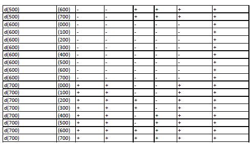

---
## Front matter
lang: ru-RU
title: Лабораторная работа №2
subtitle: "Дискреционное разграничение прав в Linux. Основные атрибуты"
author:
  - Егорова Диана Витальевна
institute:
  - Российский университет дружбы народов, Москва, Россия
date: 16 сентября 2023

## i18n babel
babel-lang: russian
babel-otherlangs: english

## Fonts

mainfont: PT Serif
romanfont: PT Serif
sansfont: PT Sans
monofont: PT Mono
mainfontoptions: Ligatures=TeX
romanfontoptions: Ligatures=TeX
sansfontoptions: Ligatures=TeX,Scale=MatchLowercase
monofontoptions: Scale=MatchLowercase,Scale=0.9

## Formatting pdf
toc: false
toc-title: Содержание
slide_level: 2
aspectratio: 169
section-titles: true
theme: metropolis
header-includes:
 - \metroset{progressbar=frametitle,sectionpage=progressbar,numbering=fraction}
 - '\makeatletter'
 - '\beamer@ignorenonframefalse'
 - '\makeatother'
---

# Информация

## Докладчик

:::::::::::::: {.columns align=center}
::: {.column width="70%"}
  * Егорова Диана Витальевна
  * студент кафедры математического модулирования и искусственного интеллекта
  * Российский университет дружбы народов
  * [1032201662@rudn.ru](mailto:1032201662@rudn.ru)
:::
::: {.column width="30%"}

:::
::::::::::::::
# Вводная часть

## Актуальность

- Важно структурировать пространство под работы в любой сфере деятельности

## Цели и задачи

- Получить практические навыки работы в консоли с атрибутами файлов
- Закрепить теоретические основы дискреционного разграничения доступа в современных системах с открытым кодом на базе ОС Linux
- Заполнить таблицу «Установленные права и разрешённые действия»
- На основе анализа предыдущей таблицы заполнить следующую "Минимальные права для совершения операций"

## Материалы и методы

- Процессор `pandoc` для входного формата Markdown
- Операционная система `Rocky 8.6`
- Сервис для хостинга IT-проектов `GitHub`

# Результаты выполнения работы

## Создание нового пользователя

{#fig:001 width=70%}

## Просмотр параметров пользователстроки. Просмотрим файл /etc/passwd командой
cat /etc/passwd 

{#fig:002 width=70%}

## Просмотр учетной записи в файле /etc/passwd и просмотр директории

{#fig:003 width=70%}

## Создадим в домашней директории поддиректорию dir1 командой mkdir dir1

{#fig:004 width=70%}

## Работа с директорией dir1

{#fig:005 width=70%}

## Начинаем заполнять таблицу 1 «Установленные права и разрешённые действия» 

{#fig:006 width=70%}

## Заполнение таблицы «Установленные права и разрешённые действия»

{#fig:008 width=70%}

## Заполнение таблицы «Установленные права и разрешённые действия»

{#fig:009 width=70%}

## Проверка на минимальные необходимые права для создания поддиректории 
{#fig:007 width=70%}

## Заполнение таблицы "Минимальные права для совершения операций" 

{#fig:010 width=70%}

# Вывод

Были получены практические навыки работы в консоли с атрибутами файлов, закреплены теоретические основы дискреционного разграничения доступа в современных системах с открытым кодом на базе ОС Linux.
