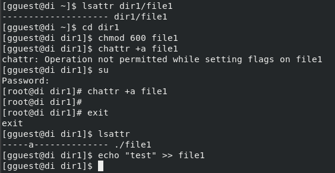
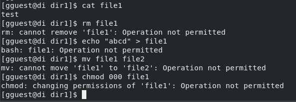
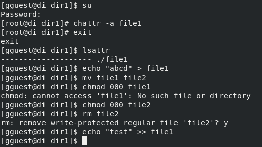
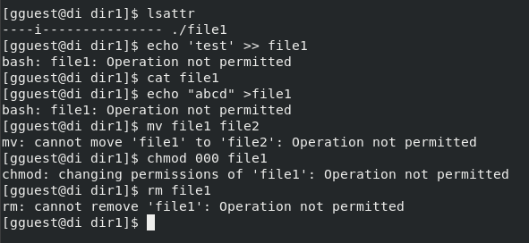

---
## Front matter
lang: ru-RU
title: Лабораторная работа №4
subtitle: "Дискреционное
разграничение прав в Linux. Расширенные
атрибуты
"
author:
  - Егорова Диана Витальевна
institute:
  - Российский университет дружбы народов, Москва, Россия
date: 29 сентября 2023

## i18n babel
babel-lang: russian
babel-otherlangs: english

## Fonts

mainfont: PT Serif
romanfont: PT Serif
sansfont: PT Sans
monofont: PT Mono
mainfontoptions: Ligatures=TeX
romanfontoptions: Ligatures=TeX
sansfontoptions: Ligatures=TeX,Scale=MatchLowercase
monofontoptions: Scale=MatchLowercase,Scale=0.9

## Formatting pdf
toc: false
toc-title: Содержание
slide_level: 2
aspectratio: 169
section-titles: true
theme: metropolis
header-includes:
 - \metroset{progressbar=frametitle,sectionpage=progressbar,numbering=fraction}
 - '\makeatletter'
 - '\beamer@ignorenonframefalse'
 - '\makeatother'
---

# Информация

## Докладчик

:::::::::::::: {.columns align=center}
::: {.column width="70%"}
  * Егорова Диана Витальевна
  * студент кафедры математического модулирования и искусственного интеллекта
  * Российский университет дружбы народов
  * [1032201662@rudn.ru](mailto:1032201662@rudn.ru)
:::
::: {.column width="30%"}

:::
::::::::::::::
# Вводная часть

## Актуальность

- Важно иметь навыки работы в консоли с атрибутами файлов
  
## Цели и задачи

Получение практических навыков работы в консоли с расширенными атрибутами файлов.

## Материалы и методы

- Процессор `pandoc` для входного формата Markdown
- Операционная система `Rocky 8.6`
- Сервис для хостинга IT-проектов `GitHub`

# Результаты выполнения работы

## Теоретическое введение 

Помимо прав доступа каждый из файлов стандартной файловой системы Linux имеет набор атрибутов, регламентирующих особенности работы с ним. Chattr - это команда в Linux, 
которая позволяет пользователю устанавливать и снимать определенные атрибуты файла. Доступны следующие атрибуты: a, A, c, C, D, e, i, j, s, S, t, u.

## Расширенный атрибут a

{#fig:001 width=70%} 

## Расширенный атрибут a

{#fig:001 width=70%} 

## Снятие атрибута a

{#fig:001 width=70%} 

## Расширенный атрибут i

{#fig:002 width=70%}

# Вывод

Получены практические навыки работы в консоли с расширенными атрибутами файлов. 
