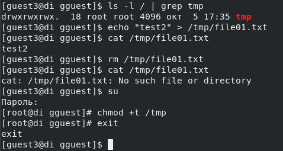

---
## Front matter
lang: ru-RU
title: Лабораторная работа №5
subtitle: "Дискреционное разграничение прав в Linux. Исследование влияния дополнительных атрибутов"
author:
  - Егорова Диана Витальевна
institute:
  - Российский университет дружбы народов, Москва, Россия
date: 05 октября 2023

## i18n babel
babel-lang: russian
babel-otherlangs: english

## Fonts

mainfont: PT Serif
romanfont: PT Serif
sansfont: PT Sans
monofont: PT Mono
mainfontoptions: Ligatures=TeX
romanfontoptions: Ligatures=TeX
sansfontoptions: Ligatures=TeX,Scale=MatchLowercase
monofontoptions: Scale=MatchLowercase,Scale=0.9

## Formatting pdf
toc: false
toc-title: Содержание
slide_level: 2
aspectratio: 169
section-titles: true
theme: metropolis
header-includes:
 - \metroset{progressbar=frametitle,sectionpage=progressbar,numbering=fraction}
 - '\makeatletter'
 - '\beamer@ignorenonframefalse'
 - '\makeatother'
---

# Информация

## Докладчик

:::::::::::::: {.columns align=center}
::: {.column width="70%"}
  * Егорова Диана Витальевна
  * студент кафедры математического модулирования и искусственного интеллекта
  * Российский университет дружбы народов
  * [1032201662@rudn.ru](mailto:1032201662@rudn.ru)
:::
::: {.column width="30%"}

:::
::::::::::::::

# Вводная часть

## Актуальность

- Важно иметь навыки работы исследования влияния дополнительных атрибутов
  
## Цели и задачи

Изучение механизмов изменения идентификаторов, применения SetUID и Sticky-битов. Получение практических навыков работы в консоли с дополнительными атрибутами. Рассмотрение работы механизма смены идентификатора процессов пользователей, а также влияние бита Sticky на запись и удаление файлов.

## Материалы и методы

- Процессор `pandoc` для входного формата Markdown
- Операционная система `Rocky 8.6`
- Сервис для хостинга IT-проектов `GitHub`

## Теоретическое введение 

- SUID - разрешение на установку идентификатора пользователя. Это бит разрешения, который позволяет пользователю запускать исполняемый файл с правами владельца этого файла. 

- SGID - разрешение на установку идентификатора группы. Принцип работы очень похож на SUID с отличием, что файл будет запускаться пользователем от имени группы, которая владеет файлом.

# Результаты выполнения работы

## Подготовка 

{ #fig:001 width=70% height=70%}

## Программа simpleid

{ #fig:002 width=70% height=70%}

## Выполнение программы simpleid

{ #fig:003 width=70% height=70%}

## Программа simpleid2

{ #fig:004 width=70% height=70%}

## Выполнение программы simpleid2

{ #fig:005 width=70% height=70%}

## Программа readfile

{ #fig:007 width=70% height=70%}

## Проверки на чтение

{ #fig:008 width=70% height=70%}

## Исследование Sticky-бита

{ #fig:009 width=70% height=70%}

## Исследование Sticky-бита

{ #fig:010 width=70% height=70%}

# Выводы

## Результаты выполнения лабораторной работы

Изучили механизмы изменения идентификаторов, применения SetUID- и Sticky-битов. Получили практические навыки работы в консоли с дополнительными атрибутами. Также мы рассмотрели работу механизма смены идентификатора процессов пользователей и влияние бита Sticky на запись и удаление файлов.
