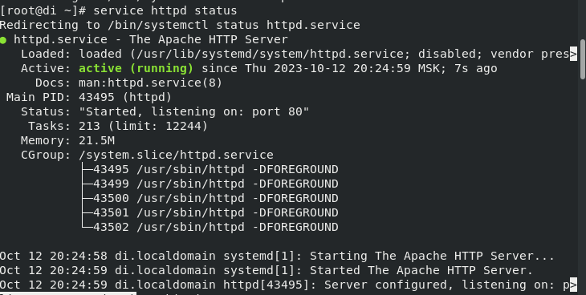
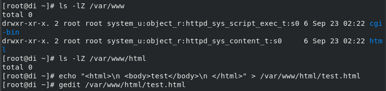
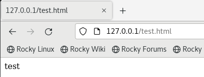
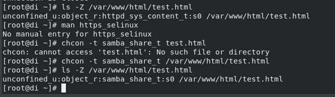
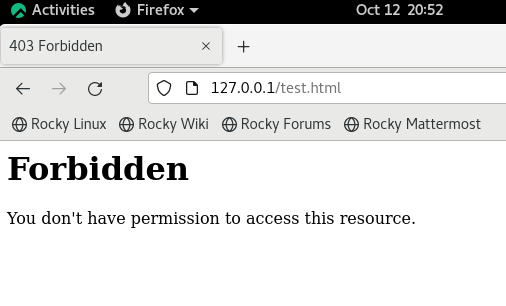
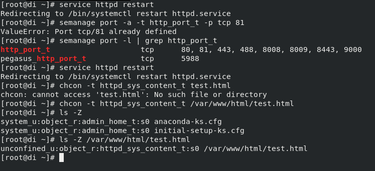
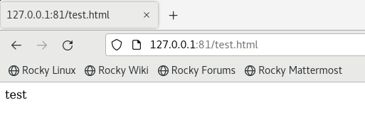

---
## Front matter
lang: ru-RU
title: Лабораторная работа №6
subtitle: "Мандатное разграничение прав в Linux"
author:
  - Егорова Диана Витальевна
institute:
  - Российский университет дружбы народов, Москва, Россия
date: 14 октября 2023

## i18n babel
babel-lang: russian
babel-otherlangs: english

## Fonts

mainfont: PT Serif
romanfont: PT Serif
sansfont: PT Sans
monofont: PT Mono
mainfontoptions: Ligatures=TeX
romanfontoptions: Ligatures=TeX
sansfontoptions: Ligatures=TeX,Scale=MatchLowercase
monofontoptions: Scale=MatchLowercase,Scale=0.9

## Formatting pdf
toc: false
toc-title: Содержание
slide_level: 2
aspectratio: 169
section-titles: true
theme: metropolis
header-includes:
 - \metroset{progressbar=frametitle,sectionpage=progressbar,numbering=fraction}
 - '\makeatletter'
 - '\beamer@ignorenonframefalse'
 - '\makeatother'
---

# Информация

## Докладчик

:::::::::::::: {.columns align=center}
::: {.column width="70%"}
  * Егорова Диана Витальевна
  * студент кафедры математического модулирования и искусственного интеллекта
  * Российский университет дружбы народов
  * [1032201662@rudn.ru](mailto:1032201662@rudn.ru)
:::
::: {.column width="30%"}

:::
::::::::::::::

# Вводная часть

## Актуальность

- Важно иметь навыки работы c SELinx и Apache
  
## Цели и задачи

- Развить навыки администрирования ОС Linux. Получить первое практическое знакомство с технологией SELinux.
- Проверить работу SELinx на практике совместно с веб-сервером Apache.

## Материалы и методы

- Процессор `pandoc` для входного формата Markdown
- Операционная система `Rocky 8.6`
- Сервис для хостинга IT-проектов `GitHub`

## Теоретическое введение 

SELinux или Security Enhanced Linux — это улучшенный механизм управления доступом, разработанный Агентством национальной безопасности США (АНБ США) для предотвращения злонамеренных вторжений. Он реализует принудительную (или мандатную) модель управления доступом (англ. Mandatory Access Control, MAC) поверх существующей дискреционной (или избирательной) модели (англ. Discretionary Access Control, DAC), то есть разрешений на чтение, запись, выполнение.

## Теоретическое введение 

Apache – это свободное программное обеспечение для размещения веб-сервера. Он хорошо показывает себя в работе с масштабными проектами, поэтому заслуженно считается одним из самых популярных веб-серверов. Кроме того, Apache очень гибок в плане настройки, что даёт возможность реализовать все особенности размещаемого веб-ресурса.

## Цель лабораторной работы

Развить навыки администрирования ОС Linux. Получить первое практическое знакомство с технологией SELinux. Проверить работу SELinx на практике совместно с веб-сервером Apache

# Выполнение лабораторной работы

## Запуск HTTP-сервера

{ #fig:001 width=70% height=70%}

## Создание HTML-файла

{ #fig:002 width=70% height=70%}

## Создание HTML-файла

{ #fig:003 width=70% height=70%}

## Изменение контекста безопасности

{ #fig:004 width=70% height=70%}

## Изменение контекста безопасности

{ #fig:005 width=70% height=70%}

## Переключение порта и восстановление контекста безопасности

{ #fig:006 width=70% height=70%}

## Переключение порта и восстановление контекста безопасности

{ #fig:007 width=70% height=70%}

# Выводы

## Результаты выполнения лабораторной работы

В процессе выполнения лабораторной работы мною были получены базовые навыки работы с технологией SELinx и Apache.
