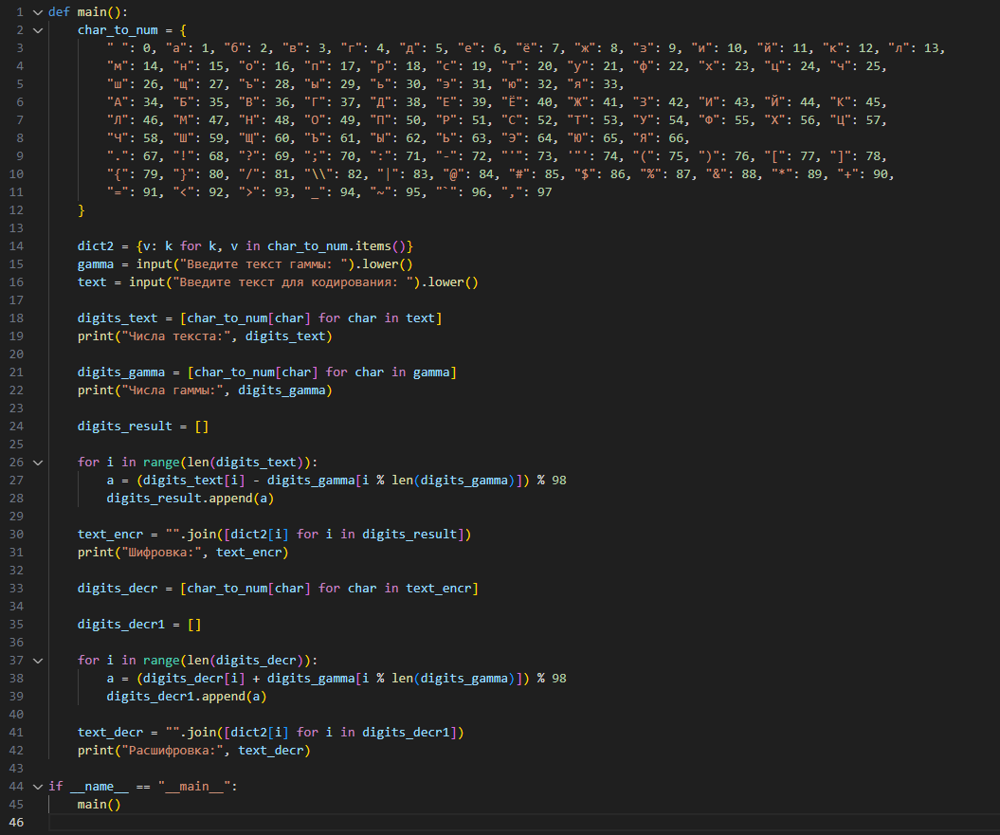
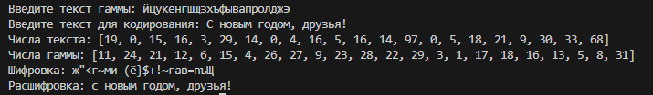

---
## Front matter
lang: ru-RU
title: Лабораторная работа № 7
subtitle: "Элементы криптографии. Однократное гаммирование"
author:
  - Егорова Диана Витальевна
institute:
  - Российский университет дружбы народов, Москва, Россия
date: 21 октября 2023

## i18n babel
babel-lang: russian
babel-otherlangs: english

## Fonts

mainfont: PT Serif
romanfont: PT Serif
sansfont: PT Sans
monofont: PT Mono
mainfontoptions: Ligatures=TeX
romanfontoptions: Ligatures=TeX
sansfontoptions: Ligatures=TeX,Scale=MatchLowercase
monofontoptions: Scale=MatchLowercase,Scale=0.9

## Formatting pdf
toc: false
toc-title: Содержание
slide_level: 2
aspectratio: 169
section-titles: true
theme: metropolis
header-includes:
 - \metroset{progressbar=frametitle,sectionpage=progressbar,numbering=fraction}
 - '\makeatletter'
 - '\beamer@ignorenonframefalse'
 - '\makeatother'
---

# Информация

## Докладчик

:::::::::::::: {.columns align=center}
::: {.column width="70%"}
  * Егорова Диана Витальевна
  * студент кафедры математического модулирования и искусственного интеллекта
  * Российский университет дружбы народов
  * [1032201662@rudn.ru](mailto:1032201662@rudn.ru)
:::
::: {.column width="30%"}

:::
::::::::::::::

# Вводная часть

## Актуальность

- Важно понимать, что такое гаммирование
  
## Цели и задачи

Освоить на практике применение режима однократного гаммирования

## Материалы и методы

- Процессор `pandoc` для входного формата Markdown
- Операционная система `Rocky 8.6`
- Сервис для хостинга IT-проектов `GitHub`

## Теоретическое введение 

Гаммирование – это наложение (снятие) на открытые (зашифрованные) данные криптографической гаммы, т.е. последовательности элементов данных, вырабатываемых с помощью некоторого криптографического алгоритма, для получения зашифрованных (открытых) данных.

## Теоретическое введение 

Наложение (или снятие) гаммы на блок сообщения в рассматриваемом нами стандарте реализуется с помощью операции побитного сложения по модулю 2 (XOR). То есть при шифровании сообщений каждый блок открытого сообщения ксорится с блоком криптографической гаммы, длина которого должна соответствовать длине блоков открытого сообщения. При этом, если размер блока исходного текста меньше, чем размер блока гаммы, блок гаммы обрезается до размера блока исходного текста (выполняется процедура усечения гаммы).

# Выполнение лабораторной работы

## Код на языке python

{ #fig:001 width=70% height=70%}

## Пример работы программы

{ #fig:002 width=70% height=70%}

# Выводы

## Результаты выполнения лабораторной работы

Изучили алгоритм шифрования с помощью гаммирования
