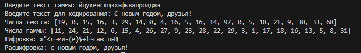

---
## Front matter
title: "Отчет по лабораторной работе №7"
subtitle: " Элементы криптографии. Однократное гаммирование"
author: "Егорова Диана Витальевна"

## Generic otions
lang: ru-RU
toc-title: "Содержание"

## Bibliography
bibliography: bib/cite.bib
csl: pandoc/csl/gost-r-7-0-5-2008-numeric.csl

## Pdf output format
toc: true # Table of contents
toc-depth: 2
lof: true # List of figures
lot: true # List of tables
fontsize: 12pt
linestretch: 1.5
papersize: a4
documentclass: scrreprt
## I18n polyglossia
polyglossia-lang:
  name: russian
  options:
	- spelling=modern
	- babelshorthands=true
polyglossia-otherlangs:
  name: english
## I18n babel
babel-lang: russian
babel-otherlangs: english
## Fonts
mainfont: PT Serif
romanfont: PT Serif
sansfont: PT Sans
monofont: PT Mono
mainfontoptions: Ligatures=TeX
romanfontoptions: Ligatures=TeX
sansfontoptions: Ligatures=TeX,Scale=MatchLowercase
monofontoptions: Scale=MatchLowercase,Scale=0.9
## Biblatex
biblatex: true
biblio-style: "gost-numeric"
biblatexoptions:
  - parentracker=true
  - backend=biber
  - hyperref=auto
  - language=auto
  - autolang=other*
  - citestyle=gost-numeric
## Pandoc-crossref LaTeX customization
figureTitle: "Рис."
tableTitle: "Таблица"
listingTitle: "Листинг"
lofTitle: "Список иллюстраций"
lotTitle: "Список таблиц"
lolTitle: "Листинги"
## Misc options
indent: true
header-includes:
  - \usepackage{indentfirst}
  - \usepackage{float} # keep figures where there are in the text
  - \floatplacement{figure}{H} # keep figures where there are in the text
---

# Цель работы

Освоить на практике применение режима однократного гаммирования

# Теоретические сведения

## Шифр гаммирования

Гаммирование – это наложение (снятие) на открытые (зашифрованные) данные криптографической гаммы, т.е. последовательности элементов данных, вырабатываемых с помощью некоторого криптографического алгоритма, для получения зашифрованных (открытых) данных.

Принцип шифрования гаммированием заключается в генерации гаммы шифра с помощью датчика псевдослучайных чисел и наложении полученной гаммы шифра на открытые данные обратимым образом (например, используя операцию сложения по модулю 2). Процесс дешифрования сводится к повторной генерации гаммы шифра при известном ключе и наложении такой же гаммы на зашифрованные данные.
Полученный зашифрованный текст является достаточно трудным для раскрытия в том случае, если гамма шифра не содержит повторяющихся битовых последовательностей и изменяется случайным образом для каждого шифруемого слова. Если период гаммы превышает длину всего зашифрованного текста и неизвестна никакая часть исходного текста, то шифр можно раскрыть только прямым перебором (подбором ключа). В этом случае криптостойкость определяется размером ключа.

Метод гаммирования становится бессильным, если известен фрагмент исходного текста и соответствующая ему шифрограмма. В этом случае простым вычитанием по модулю 2 получается отрезок псевдослучайной последовательности и по нему восстанавливается вся эта последовательность.

Метод гаммирования с обратной связью заключается в том, что для получения сегмента гаммы используется контрольная сумма определенного участка шифруемых данных. Например, если рассматривать гамму шифра как объединение непересекающихся множеств H(j), то процесс шифрования можно пердставить следующими шагами:

1. Генерация сегмента гаммы H(1) и наложение его на соответствующий участок шифруемых данных.

2. Подсчет контрольной суммы участка, соответствующего сегменту гаммы H(1).

3. Генерация с учетом контрольной суммы уже зашифрованного участка данных следующего сегмента гамм H(2).

4. Подсчет контрольной суммы участка данных, соответствующего сегменту данных H(2) и т.д.

# Выполнение работы

## Реализация шифратора и дешифратора Python

```
def main():
    char_to_num = {
        " ": 0, "а": 1, "б": 2, "в": 3, "г": 4, "д": 5, "е": 6, "ё": 7, "ж": 8, "з": 9, "и": 10, "й": 11, "к": 12, "л": 13,
        "м": 14, "н": 15, "о": 16, "п": 17, "р": 18, "с": 19, "т": 20, "у": 21, "ф": 22, "х": 23, "ц": 24, "ч": 25,
        "ш": 26, "щ": 27, "ъ": 28, "ы": 29, "ь": 30, "э": 31, "ю": 32, "я": 33,
        "А": 34, "Б": 35, "В": 36, "Г": 37, "Д": 38, "Е": 39, "Ё": 40, "Ж": 41, "З": 42, "И": 43, "Й": 44, "К": 45,
        "Л": 46, "М": 47, "Н": 48, "О": 49, "П": 50, "Р": 51, "С": 52, "Т": 53, "У": 54, "Ф": 55, "Х": 56, "Ц": 57,
        "Ч": 58, "Ш": 59, "Щ": 60, "Ъ": 61, "Ы": 62, "Ь": 63, "Э": 64, "Ю": 65, "Я": 66,
        ".": 67, "!": 68, "?": 69, ";": 70, ":": 71, "-": 72, "'": 73, '"': 74, "(": 75, ")": 76, "[": 77, "]": 78,
        "{": 79, "}": 80, "/": 81, "\\": 82, "|": 83, "@": 84, "#": 85, "$": 86, "%": 87, "&": 88, "*": 89, "+": 90,
        "=": 91, "<": 92, ">": 93, "_": 94, "~": 95, "`": 96, ",": 97
    }

    dict2 = {v: k for k, v in char_to_num.items()}
    gamma = input("Введите текст гаммы: ").lower()
    text = input("Введите текст для кодирования: ").lower()

    digits_text = [char_to_num[char] for char in text]
    print("Числа текста:", digits_text)

    digits_gamma = [char_to_num[char] for char in gamma]
    print("Числа гаммы:", digits_gamma)

    digits_result = []

    for i in range(len(digits_text)):
        a = (digits_text[i] - digits_gamma[i % len(digits_gamma)]) % 98
        digits_result.append(a)

    text_encr = "".join([dict2[i] for i in digits_result])
    print("Шифровка:", text_encr)

    digits_decr = [char_to_num[char] for char in text_encr]

    digits_decr1 = []

    for i in range(len(digits_decr)):
        a = (digits_decr[i] + digits_gamma[i % len(digits_gamma)]) % 98
        digits_decr1.append(a)

    text_decr = "".join([dict2[i] for i in digits_decr1])
    print("Расшифровка:", text_decr)

if __name__ == "__main__":
    main()

```

## Контрольный пример (рис. @fig:001)

{ #fig:001 width=70% height=70%}

# Выводы

Изучили алгоритмы шифрования на основе гаммирования

# Список литературы{.unnumbered}

1. [Шифрование методом гаммирования](http://altaev-aa.narod.ru/security/XOR.html)
2. [Режим гаммирования в блочном алгоритме шифрования](https://kabinfo.ucoz.ru/index/shifr_reshetka_kardano/0-374)
